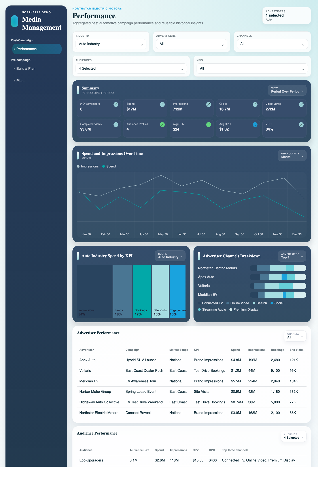

# Northstar Planning Demo

Lightweight client-safe demo of a media planning platform built with React, TypeScript, and Vite.

## Demo Preview

### Performance



## What it includes

- `Performance` for historical automotive campaign analysis
- `Build a Plan` for prompt-driven campaign setup
- `Plans` for the generated campaign recommendation

## Running locally

With a standard local Node install:

```bash
npm install
npm run dev -- --host 127.0.0.1 --port 4173
```

This workspace also contains a vendored Node runtime for local recovery on machines without a working Node setup, but that runtime is intentionally not tracked in git.

## Build

```bash
npm run build
```

## Product Docs

See the files in [docs](./docs):

- `demo-rules.md`
- `decision-log.md`
- `reasoning.md`
- `requirements.md`
- `non-decisions.md`
